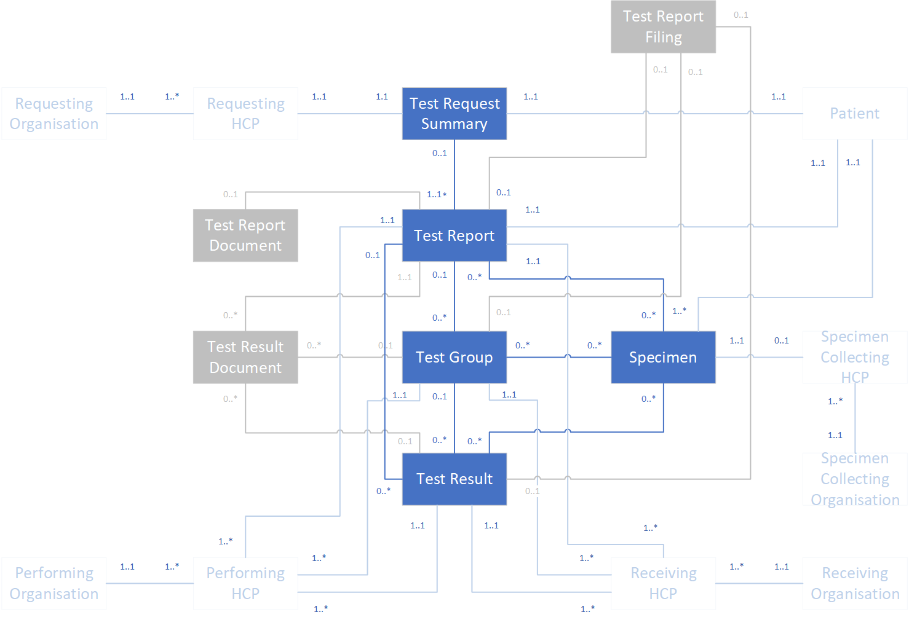





## Scope ##

The National Pathology FHIR Messaging Specification supports the ability to share pathology results in NHS primary and secondary care settings. This release focuses on haematology and clinical biochemistry (also known as chemical pathology) test reporting. It defines a FHIR STU3 payload to allow test results to be sent from a Laboratory Information Management System (LIMS) to a requesting system. It is anticipated that the messaging specification and implementation guidance will be updated following First of Type (FoT) implementation.

Potential future releases may include support for:

- other pathology specialisms and diagnostic areas
- the definition of FHIR profiles to support pathology test requests

The following are currently outside the scope of this work:

- the sharing of pathology results relating to national screening programmes
- laboratory to laboratory communications

## Definition of Terms ##

When describing pathology reports different regions and professions sometimes use different words to describe the same entities. Therefore, for the avoidance of confusion, within the context of this guidance the following terms have these definitions:

- Test group – this describes any group of related tests that has been defined by the laboratory or other providing organisation. The individual tests within a test group may differ between organisations. Test groups are often referred to as batteries, panels and profiles. A common example is a Full Blood Count, with typically comprises approximately 16 individual tests.
- Test result - this is the result that has been provided by the laboratory or other provider. These may be standalone results or may be a part of a ‘Test group’. They are also sometimes referred to as test analytes.

## Process Overview ##

Pathology data is used to support many aspects of patient care, including screening, diagnostic testing, treatment advice and the monitoring and management of conditions.

Although the focus of this release is on pathology test reporting, to provide wider context it is also useful to consider the test requesting process. The following describes a simplified, generic pathology test request and test report cycle (without any exception or alternative process flows):

1.	The Requesting Health Care Professional (HCP) determines that a patient requires a pathology test, for example to aid the diagnosis of a suspected condition or to monitor an existing condition.
2.	The Requesting HCP sends a test request to a designated pathology laboratory (typically based in a hospital trust).
3.	The patient provides a specimen. 
4.	The specimen is collected and sent to the laboratory.
5.	Upon receipt at the laboratory, the specimen is checked and matched with the test request. The details are recorded in the LIMS.
6.	The specimen is prepared, and the test(s) performed.
7.	The test report is generated and authorised for release.
8.	The test report is sent to the Requesting HCP.
9.	The test report is received by the Requesting HCP.
10.	The patient is informed of the test results and, if required, the Requesting HCP takes further action, for example, initiates a course of treatment, requests further tests or refers the patient to a specialist.

This process is illustrated in the following diagram:



There are many possible variations and exceptions to this basic process, including:

-	The type of Requesting Organisation (e.g. primary care, secondary care, community) and the role of the Requesting HCP.
-	The type of care that the patient is receiving e.g. in-patient, out-patient, community
-	Whether the test request is sent electronically or on paper.
-	The type and number of required tests.
-	The type and number of required specimens. Depending on the requested tests, a mix of specimen types may be required e.g. blood and urine. In a dynamic function test (e.g. a Glucose Tolerance Test) a series of samples are collected at defined time points before and after an intervention to assess the response to that intervention.
-	The organisation and HCP responsible for collecting the specimen and the location, timing and method of collection. In some cases, the Specimen Collecting Organisation and/or HCP may differ from the Requesting Organisation / HCP. For example, in the scenario where a patient is referred by their GP to attend a haematology clinic at a hospital.
-	The method used to transport the specimen(s) to the laboratory.
-	The processes that are used to handle missing or damaged specimens.
-	Whether the laboratory sends the test request and specimen(s) to another laboratory for analysis. These are known as send-away or referred tests. 
-	Whether the laboratory initiates further tests (using the supplied specimens) based on the results of the requested tests. For example, to provide a clearer interpretation of a result or to confirm a diagnosis. These are known as reflex tests.
-	Whether the test is performed at the point of care i.e. at or near the site of patient care rather than in a laboratory. 
-	Whether the test report is sent electronically or on paper.
-	Whether one or more interim reports are issued before a final report is sent to the Requesting Organisation.

Several key clinical scenarios are documented elsewhere in this guidance. These illustrate some of the variations in process outlined above, together with example test reports.

## Test Report Structure – Logical Data Model ##

The following entity diagram describes the logical data model that the National Pathology FHIR specification is based on:

This model was developed jointly by the National Pathology, GP Connect and GP2GP teams within NHS Digital. The Test Report Filing entity relates to the process undertaken by the receiving health care professional when they review the test results and is not directly part of the scope of the National Pathology FHIR Messaging Specification. Please refer to the GP Connect pathology messaging guidance for further details.

The Test Report Document entity represents the test report in the format that it was received by the Requesting Organisation. The Test Result Document entity represents documents that form part of the test results, for example, images and charts. Both entities are out of scope for the current release but for completeness are included in the diagram.

The core pathology related entities are highlighted in dark blue. The remaining entities, outlined in light grey, represent the patient, and the organisations and practitioners associated with the pathology reporting process.

The following table summarises each of the core pathology entities:

|-------------|-------------|
| Entity Name | Description |
|Test Report	|The summary data from the test report including the clinical interpretation|
|Test Group	|Output from a group of tests including the clinical interpretation|
|Test Result|	Output from a single test including the clinical interpretation|
|Specimen	|Information on the specimen tested.|
|Test Request Summary	|A summary of the original test request that is returned with the test report|

The Messaging Architecture section of this guidance describes how these business entities are represented in FHIR.

